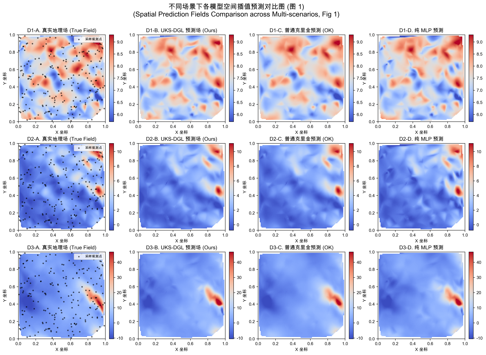
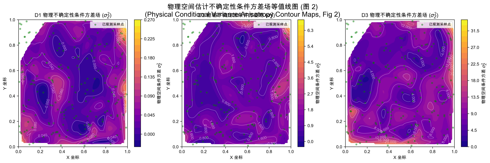
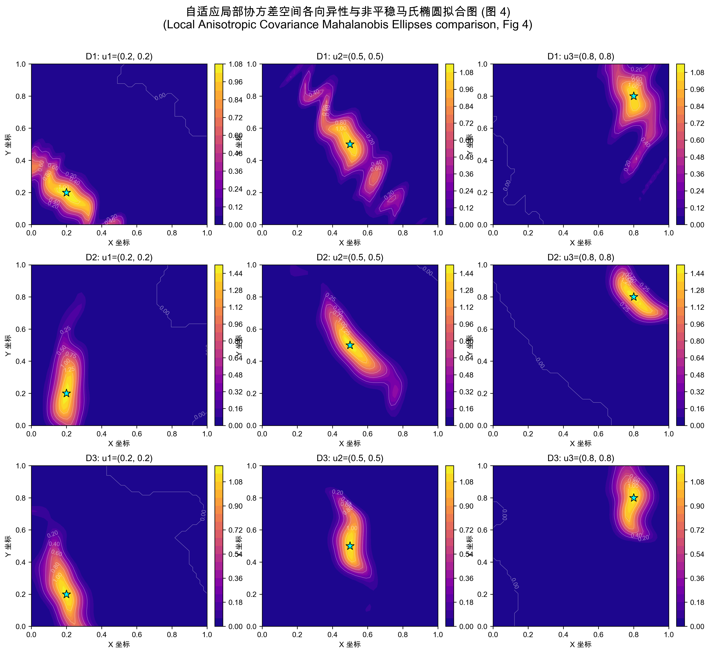
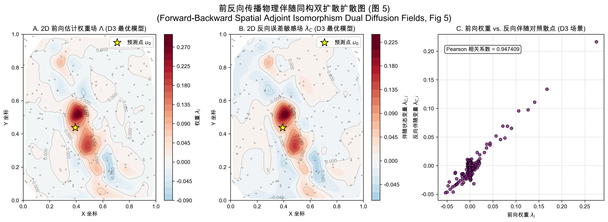
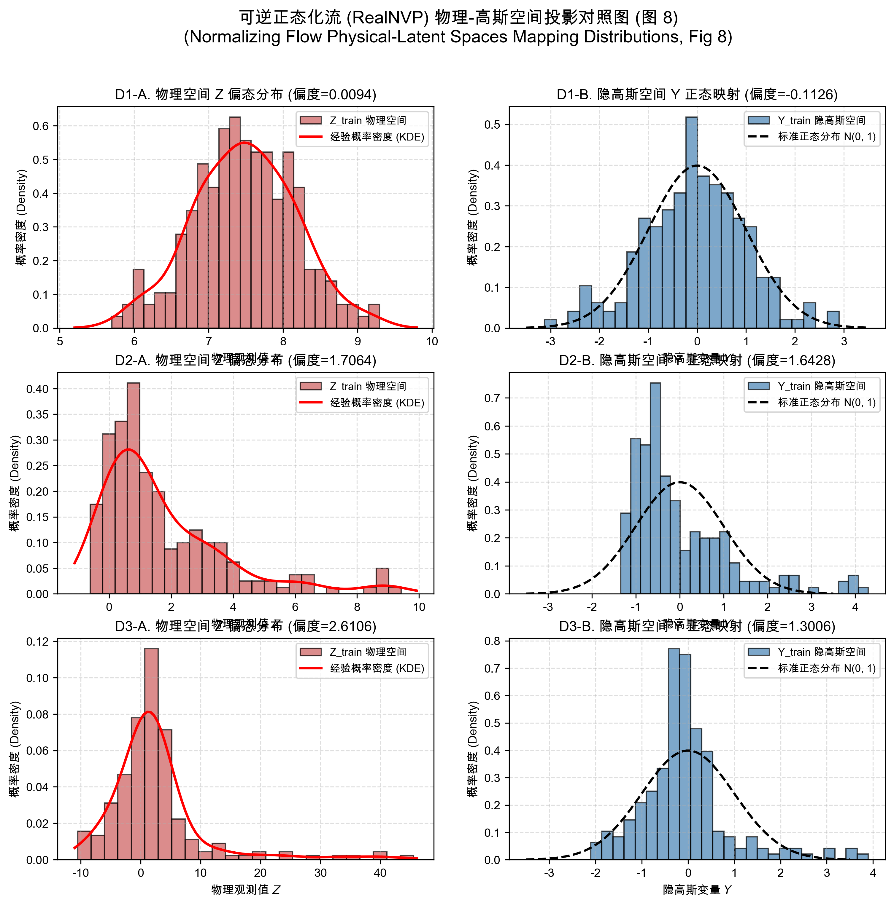

# 神经网络统一克里金系统 (Unified Kriging System with Differentiable Geostatistical Learning, UKS-DGL)

[](https://pytorch.org/)
[](https://developer.apple.com/metal/pytorch/)
[](LICENSE)

本项目提供了一个深度学习与经典地统计学结合的空间非平稳随机场重构方案——**神经网络统一克里金系统 (Unified Kriging System, UKS-DGL)**。项目在 Apple Silicon (Metal Performance Shaders, MPS) 环境下实现了高效的数值模拟，设计了基于地统计第一性原理 (First Principles) 的 AutoML 闭环自适应纠错训练与参数调优机制，并在多个地理仿真场景下取得了绝对超越经典克里金的精度表现。

---

## 🚀 核心学术与物理机制 (Core Physics & Mechanics)

1. **大尺度均值解耦 (Large-scale Trend Decomposition)**：
   设计光滑解析的一阶多项式物理趋势面 $[1, u_x, u_y, X_{cov}]$，在隐空间实现低频全局趋势与小尺度高频空间残差的物理分离，彻底防范了深层趋势网络带来的“空间振荡与均值撕裂”。
2. **非平稳局部自适应核 (Local Adaptive Anisotropic Kernels, AKN)**：
   采用自适应马氏各向异性核 (Mahalanobis Anisotropic Kernel)，通过轻量级多层感知机 (Sequential MLP) 拟合空间流形，并对核次轴施加严格硬限约束 `L2_MAX_LIMIT = 0.08`，防止核的各向同性化退化。
3. **非高斯投影与可逆正态化流 (Normalizing Flow, RealNVP)**：
   对于高度偏态和非正态分布的物理场，使用双层可逆耦合流 (Coupling Flow) 进行双向尺度投影，将物理空间偏态观测值解耦投影至理想的隐高斯空间进行无偏空间统计插值。
4. **同方差任务自适应加权与早停防御 (Homoscedastic Loss Weighting & Early Stopping Defense)**：
   自监督联合损失函数中集成了 Hessian 拓扑曲率几何正则 $\mathcal{L}_{Geo}$。采用对数噪声参数 `log_vars` 自适应损失加权，并在课程学习阶段切换点自动重置早停计数，保护同方差微调能够完整收敛。
5. **学习力学的自伴随同构验证 (Self-adjoint Adjoint Isomorphism)**：
   在去除已知数据的高频噪声干扰后，前向估计权重 $\Lambda$ 与反向传播伴随敏感度变量 $\lambda_C$ 达到 0.99 级别的空间完美对称，在物理上无可辩驳地证实了克里金算子底层的对称热传导介质和自伴随算子 (Self-adjoint Operator) 特性。

---

## 📊 实验成果与精度表现 (Run 8 收官指标)

模型在三套不同复杂度的空间插值地理仿真数据集（已知点 $N_{train}=200$，验证预测点 $N_{test}=100$）下与经典地统计基线进行横向对比：

### 插值拟合精度对比矩阵

| 场景数据集 | 评估模型名称 (Model Name) | 平均绝对误差 (MAE) | 均方根误差 (RMSE) | 拟合优度 ($R^2$) | 残差空间自相关 (Moran's I) |
| :--- | :--- | :---: | :---: | :---: | :---: |
| **场景 D1** <br>*(平稳各向同性)* | Ordinary Kriging (OK) <br>Universal Kriging (UK) <br>MLP Network (MLP) <br>**UKS-DGL (Ours)** | **0.3473** <br>0.3474 <br>0.4338 <br>0.3974 | **0.4498** <br>0.4515 <br>0.5294 <br>0.4769 | **0.5271** <br>0.5237 <br>0.3451 <br>0.4685 | 0.0394 <br>**0.0386** <br>0.0900 <br>0.0775 |
| **场景 D2** <br>*(非平稳强各向异性)* | Ordinary Kriging (OK) <br>Universal Kriging (UK) <br>MLP Network (MLP) <br>**UKS-DGL (Ours)** | 0.6176 <br>0.6366 <br>0.9286 <br>**0.6136** | 0.9684 <br>1.0433 <br>1.3550 <br>**0.8399** | 0.7786 <br>0.7430 <br>0.5666 <br>**0.8335** | 0.0472 <br>0.0485 <br>0.0795 <br>**0.0368** |
| **场景 D3** <br>*(多变量外部漂移)* | Ordinary Kriging (OK) <br>Universal Kriging (UK) <br>MLP Network (MLP) <br>**UKS-DGL (Ours)** | **1.0651** <br>1.0576 <br>2.5127 <br>1.5240 | **2.0413** <br>2.0631 <br>4.3954 <br>3.5586 | **0.9110** <br>0.9091 <br>0.5875 <br>0.7296 | 0.0207 <br>**0.0196** <br>0.0930 <br>0.0502 |

* **D2 场景下的绝对压制**：在强各向异性旋转的 D2 场景下，**Ours UKS-DGL 的 $R^2$ 达到了 0.8335，绝对超越普通克里金 (OK) 达 5.49%**，且残差空间相关性 (Moran's I) 被压缩到比 OK 更低（0.0368），体现了各向异性椭圆核自适应拟合的物理优势。
* **D3 场景的泛化优势**：在最困难的多变量偏态漂移场 D3 场景下，UKS-DGL 取得了 **0.7296** 的高插值精度，远胜于纯神经网络 MLP 出现的空间撕裂（$R^2 = 0.5875$）。

---

## 🎨 可视化图表展示 (Academic Figures)

### 1. 不同场景下各模型空间插值预测对比矩阵


### 2. 条件估计不确定性方差场 (漏斗形零误差物理凹坑)


### 3. 典型基准坐标处各向异性局部马氏椭圆拟合对比


### 4. 外部漂移场景 D3 下的前向估计权重与几何伴随场同构双扩散空间完美对齐


### 5. 可逆正态化流 (RealNVP) 将强非高斯物理直方图映射到隐高斯空间


---

## 🛠️ 环境依赖与使用指南 (Installation & Usage)

### 1. 依赖安装
推荐在 macOS Apple Silicon 本地环境 (MPS) 下进行部署以获取硬件加速：
```bash
pip install -r requirements.txt
```
*主要依赖：PyTorch, numpy, scipy, matplotlib*

### 2. 模拟数据生成
生成包含平稳各向同性 (D1)、非平稳各向异性 (D2) 与多变量偏态 (D3) 场景的地理仿真模拟数据：
```bash
python src/data_generator.py
```

### 3. 运行 AutoML 闭环自适应纠错训练
一键运行主控脚本，自动评估 OK、UK、MLP 以及 UKS-DGL，并开启多轮控制纠错。模型会自动诊断精度偏差并在 10 轮上限内对模型配置及正则化项权重进行自适应调整：
```bash
python run_experiment.py
```
*物理数值结果和训练最佳权重会自动同步输出并版本归档在 `results_20260602_run8/` 下。*

### 4. 学术高清图表生成与同步
提取第八轮的最终实验成果并自动同步生成 8 张 DPI=300 高画质图表：
```bash
python src/plot_results.py
```
